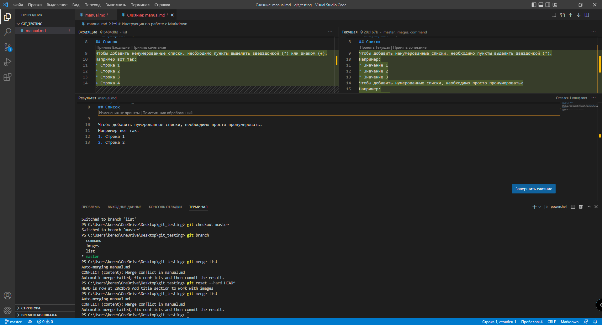

# Инструкция по работе с Markdown
## Выделение текста
Чтобы выделить текст курсивом необходимо обромить его звездочками (*) или знаком нижнего подчеркивания вот так (_). Например, вот так *курсив* или вот так _курсив_.

Чтобы выделить текст полужирным, необходимо обрамить его дввойными звездочками (**) или двойным знаком подчеркивания (__). Например, вот так **полужирный** или вот так __полужирный__.

Альтернативные способы выделения текста жирным или курсивом нужны для того, чтобы мы могли совмещать оба этих способа. Например, _текст может быть выделен курсивом и при этом может быть **полужирным**_.
## Список
Чтобы добавить ненумерованные списки, необходимо пункты выделить звездочкой (*) или (+).
Например вот так:
* Строка 1
* Строка 2
* Строка 3
Чтобы добавить нумерованные списки, необходимо просто пронумеровать.
Например вот так:
1. Строка 1
2. Строка 2
## Работа с изображениями
Чтобы вставить изображение в текст, достаточно написать следжующее: :

## Ссылки

## Работа с таблицами

## Цитаты

## Заключение

# Команды для Git
## Настройка конфигурационного файла
Для проверки корректности установки Git, необходимо прописать команду git --version. При правильной становки будет выведена текущая версия Git.

Для дальнейшей работы необходимо прописать следующие команды:
* git config --global user.email ваша почта@example.com *регистрирует почту в системе*.
* git config --global user.name «Ваше имя английскими буквами» *регистрирует ваше имя в системе*.
## Работа с Git-репозиториями
Создание репозитория в новой папке: git init.
Создание репозитория с кодом  существующей попке:
* git initFoldername
* git add --all
* git commit -m "Initial commit".
Создание репозитория из существующего решения Visual Studio:
* git init *Foldername*
* cd *Foldername*
* git add --all
* git commit -m "Initial commit".
Клонироввание репозитория в локальную папку: git clone Имя *папки URL-адреса*.
Добавление удаленного репозитория: git remote add *URL-адрес имени*.
Обновление удаленного репозитория: git remote set-url *URL-адрес имени*.
## Ветви
Создание ветви: git branch branchname.
Переключение на другую ветвь: git checkout branchname.
Создание и переключние на новую ветвь: 
git checkout -b branchname.
Удаление локальной ветви: 
git branch -d branchname.
Удаление удаленной ветви:
git push origin --delete branchname.

## Фиксации
Создание фиксации:
git commit -m "message".
Изменение последней фиксации с помощью промежуточных изменений:
git commit --amend -m "обновленное сообщение".
Размещение всех изменений файлов:
git add --all.
Настройка определенного изменения файла:
git add имя_файла.
Просмотр изменений без тегов:
git status --untracked.
удаление файла:
* git rm имя_файла
* git commit -m имя_файла.
Перемещение файла:
* fit mv имя_файла
* git commit -m "Перещено имя файла".
Добавление тегов к фиксации:
git tag -a tagnanme -m "description".

## Сравнение файлов и версий
Сравнение текущего содержимого одного файла и содержимого последней фиксации:
git diff head имя_файла
Сравниение текущей версии с ветвью:
git diff branchname.
Сравнение изменений между двумя ветвями:
git diff branchname1 branchname2.
## Синхронизация изменений
Скачивание новых ветвей и фиксаций из удаленного репозитория, но не слияние их с локальными ветвями:
git fetch.
Объединение обновлений из удаленного репозитория в локальный репозиторий:
git pull remotebranchname.
Публикация локальной ветви вввв удаленном репозитории:
igt puddh -u remotebranchname.
Синхронизация локальной вветвви с удаленной ветвью, отправввка локальных изменений и извлечение удаленных:
* git pull remotebranchname
* git push -u remotebranchname.
Принудительная отправка ветви, переписавв журнал удаленной ветви с журналом текущей ветви:
git push --force -u originremote_branchname
## Слияние и перебазация
Слияние ветви с текущей ветвью:
git merge branchname.
Слияние удаленной ветви с текущей ветвью:
git pull origin branchname.
Перебазируйте текущую ветвь в журнал другой ветви:
igt rebase branchname.
Выполнить интерактивное перебазовку последних n фиксаций:
* git rebase -i HEAD ~n (Linux и macOS)
* git rebase -i "HEAD^n" (Windows).
Выбор фиксации в текущей ветви:
git cherry-pik commitID.
Отмена всех изменений и откат к последней фиксации:
git reset --hard HEAD.
Отмена промежуточного хранения файлов, но сохранение изменений файлов:
git reset --mixed HEAD.
Удоаление неотслеженных файлов:
git clean -f.
Сброс локальной ветви до последней фиксации в удаленной ветви:
git reset --hard Удаленного/branchname (например, git reset --hard origin/main).
Отмена фиксации, отправленной в удаленный репозиторий:
git revert commitID.

